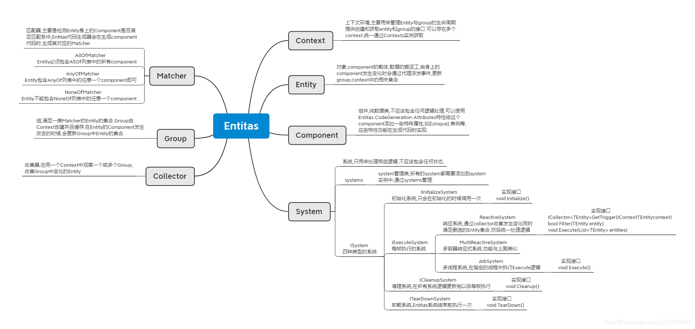
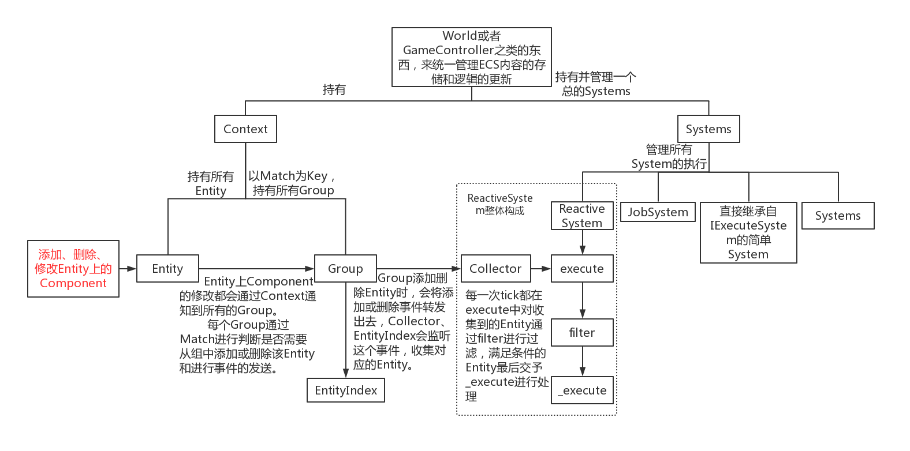

## Entitas 解析

参考来源：[ECS Entitas 源码分析系列](https://blog.csdn.net/u013781447/article/details/107225502?spm=1001.2014.3001.5502)




​                                                                    **Entitas总览**



​                                                                   **Entitas运行流程**


### 一、概括

Entitas大致可以分为以下6个模块：Context，Entity，Component，System，Matcher，Group和Collector等。

**Entitas优点**

- 天然低耦合，System和System之间互不干扰
- 天然逻辑与表现分离，Component只包含数据
- 访问速度快，Entity、Component以及Group做了大量缓存
- 由于Entitas数据的连续性，可以提高Cache命中率
- 完善的代码生成工具，提高开发效率。可以给Component添加各种Attributes，从而生成各种特殊组件，如单例[Unique]、事件[Event]、主键[EntityIndex]

**Entitas缺点**：

- Entitas是一个自闭的框架，所有事都只能在内部完成
- 游戏中不是所有功能都适合这个框架，如UI、动画等
- 因为不是OOP，是纯逻辑，会增加上手难度
- 需要生成代码，对热更新不友好
- 项目文件数量很多，维护成本提高


### 二、Context

**Context**是Entitas中的**上下文环境**，主要用于管理当前环境下所有的**Entity**以及**Group**的创建与回收。可以同时存在多个Context，Context之间互不影响，所有的Context有**Contexts单例**管理。

#### 1. Contexts

Contexs继承自IContexts，主要用于**创建和保存**当前所有的Context。

*Contexts类由Entitas的代码生成器生成，无须动手实现。*

在Entitas系统外部可通过Contexts.sharedInstance单例访问。

``` c#
// Contexts
public partial class Contexts : Entitas.IContexts {
    // 懒汉式单例访问Contexts
    public static Contexts sharedInstance {
        get {
            if (_sharedInstance == null) {
                _sharedInstance = new Contexts();
            }
             return _sharedInstance;
        }
        set { _sharedInstance = value; }
    }
    
    static Contexts _sharedInstance;
    
    public GameContext game { get; set; }
    
    public InputContext input { get; set; }
    
    public Entitas.IContext[] allContexts { get { return new Entitas.IContext [] { game, input }; } }

    public Contexts() {
        game = new GameContext();
        input = new InputContext();
    }
}
```

#### 2. ContextInfo

**ContextInfo**是Context的**信息类**，是Context初始化**参数**之一。

主要包含了Context的**名字**，**所有组件名字数组**以及**所有组件类型数组**，同时这些信息也是用来**初始化Entity**的。

``` c#
// ContextInfo
public class ContextInfo{
    public ContextInfo(string name, string[] componentNames, Type[] componentTypes)
    {
      this.name = name; // Context名字
      this.componentNames = componentNames; // 组件名字数组
      this.componentTypes = componentTypes; // 组件类型数组
    }
}
```

#### 3. Context

Context继承自IContext，管理当前上下文中的**Entity**以及**Group**。

所有Enity与Group都应通过Context的`CreatEntiy()`和`GetGroup(IMatcher<TEntity> matcher)`方法来**创建和获取**。

Context会对所有的Entity、Group**进行缓存，回收利用**。

##### 3.1 Context创建

Context无须手动创建，在Entitas的**Generate**时，代码生成器回**自动生成**对应的Context。

Context**构造方法**

``` c#
// Context
public class Context<TEntity> : IContext<TEntity>, IContext where TEntity : class, IEntity{
    
    // 构造方法
    public Context(
        int totalComponents,
        int startCreationIndex,
        ContextInfo contextInfo,
        Func<IEntity, IAERC> aercFactory,
        Func<TEntity> entityFactory)
    {
        this._totalComponents = totalComponents; // 组件类型的数量
        this._creationIndex = startCreationIndex; // Entity起始ID
        if (contextInfo != null)
        {
            this._contextInfo = contextInfo;
            if (contextInfo.componentNames.Length != totalComponents)
                // 组件数量不一致，报错
                throw new ContextInfoException((IContext) this, contextInfo);
        }
        else
            this._contextInfo = this.createDefaultContextInfo();
        
        // 创建Entity引用计数的工厂方法
        this._aercFactory = aercFactory ?? (Func<IEntity, IAERC>) (entity => (IAERC) new SafeAERC(entity));
        // 创建Entity的工厂方法
        this._entityFactory = entityFactory;
        
        // 初始化各种容器
        this._groupsForIndex = new List<IGroup<TEntity>>[totalComponents];
        this._componentPools = new Stack<IComponent>[totalComponents];
        this._entityIndices = new Dictionary<string, IEntityIndex>();
        this._groupChangedListPool = new ObjectPool<List<GroupChanged<TEntity>>>((Func<List<GroupChanged<TEntity>>>) (() => new List<GroupChanged<TEntity>>()), (Action<List<GroupChanged<TEntity>>>) (list => list.Clear()));
        
        // 缓存delegates避免gc分配
        // 主要在组件或者实体发生改变时，在代理方法中区改变对应Group中所包含的内容
        // 这也是Entitas处理大量同类型数据比较快的原因之一，避免大量的循环遍历
        this._cachedEntityChanged = new EntityComponentChanged(this.updateGroupsComponentAddedOrRemoved);
        this._cachedComponentReplaced = new EntityComponentReplaced(this.updateGroupsComponentReplaced);
        this._cachedEntityReleased = new EntityEvent(this.onEntityReleased);
        this._cachedDestroyEntity = new EntityEvent(this.onDestroyEntity);
    }
    
    // 构造默认ContextInfo
    private ContextInfo createDefaultContextInfo()
    {
      string[] componentNames = new string[this._totalComponents];
      for (int index = 0; index < componentNames.Length; ++index)
        componentNames[index] = "Index " + (object) index;
      return new ContextInfo("Unnamed Context", componentNames, (Type[]) null);
    }
}
```

##### 3.2 Entity创建

每个Context中都有一个保存当前环境Entity的对象池：`_reusableEntities`，以及当前所有活跃的Entity集合`_entities`。

所有的Entity都要通过`Context的CreateEntity()`方法创建。

```c#
// Context
public class Context<TEntity> : IContext<TEntity>, IContext where TEntity : class, IEntity{
    public TEntity CreateEntity()
    {
      TEntity entity;
      if (this._reusableEntities.Count > 0)
      {
        // 如果对象池中有对象，则取出对象并重新激活
        entity = this._reusableEntities.Pop();
        entity.Reactivate(this._creationIndex++);
      }
      else
      {
        // 否则使用工厂方法创建一个新的Entity并初始化
        entity = this._entityFactory();
        entity.Initialize(this._creationIndex++, this._totalComponents, this._componentPools, this._contextInfo, this._aercFactory((IEntity) entity));
      }
      
      // 加入活跃Entity列表中，并增加引用计数
      this._entities.Add(entity);
      entity.Retain((object) this);
      this._entitiesCache = (TEntity[]) null;
        
      // 给Entity的变化添加代理方法，用于更新Group
      entity.OnComponentAdded += this._cachedEntityChanged;
      entity.OnComponentRemoved += this._cachedEntityChanged;
      entity.OnComponentReplaced += this._cachedComponentReplaced;
      entity.OnEntityReleased += this._cachedEntityReleased;
      entity.OnDestroyEntity += this._cachedDestroyEntity;
      
      if (this.OnEntityCreated != null)
        this.OnEntityCreated((IContext) this, (IEntity) entity);
      return entity;
    }
}
```

##### 3.3 Group创建

Context中保存着当前环境中所有的Group，通过代理，在Entity发生变化，更新对应的Group。保存所有Matcher与对应的Group字典`Dictinoary<IMatcher<TEntity>, IGroup<TEntity>> _groups`，主要用于获取Group，用于Component变化时更新Group。

```C#
// Context
public class Context<TEntity> : IContext<TEntity>, IContext where TEntity : class, IEntity{
    public IGroup<TEntity> GetGroup(IMatcher<TEntity> matcher)
    {
      IGroup<TEntity> group;
        
      // 查看_groups中是否已存在该matcher的gourp，又则返回，没有就创建新的Group 
      if (!this._groups.TryGetValue(matcher, out group))
      {
        group = (IGroup<TEntity>) new Group<TEntity>(matcher);
        foreach (TEntity entity in this.GetEntities())
          // 遍历所有Entity，将匹配的加入到Group中
          group.HandleEntitySilently(entity);
        this._groups.Add(matcher, group);
          
        // 遍历matcher中所有Component序号，将Group加入到对应的_groupForIndex中
        for (int index1 = 0; index1 < matcher.indices.Length; ++index1)
        {
          int index2 = matcher.indices[index1];
          if (this._groupsForIndex[index2] == null)
            this._groupsForIndex[index2] = new List<IGroup<TEntity>>();
          this._groupsForIndex[index2].Add(group);
        }
        
        if (this.OnGroupCreated != null)
          this.OnGroupCreated((IContext) this, (IGroup) group);
      }
        
      return group;
    }
}
```

#### 4. 总结

Contex是一个**独立**的环境。

- 使用**对象池**管理当前环境中所有的**Entity的创建以及回收**
- **缓存**着所有的Group，同时通过设置**Entity改变时的代理方法**，**更新**当前环境中对应的Group

- 这样做可以减少Entity创建的开销，减少因为Entity**频繁**的创建与销毁带来的**内存碎片**，提高**内存使用率**
- 当需要某些数据集合时，通过**遍历**带来的集中性的巨大开销，分散到了各个Entity变化的时刻。


### 三、Component

在Entitas中它是一个接口类，需要实现它的接口来保存需要的数据。

同时Entitas还提供各种特殊的标签属性，通过生成代码为我们生成具体各种特殊功能的组件。

#### 1. IComponent

IComponent是一个接口，Entitas中所有自定义的Component都必须继承它。

``` c#
public interface IComponent
{
    
}
```

#### 2. ComponentsLookUp

ComponentsLookUp用来定义和查找Context中Component的相关信息。

它主要为自定义的Component定义了一个int类型的索引，在其他地方都是通过这个索引来关联对应的Component。

```c#
public static class GameComponentsLookup {

    // 定义组件索引
    public const int Debug = 0;
    public const int Input = 1;
    public const int Transform = 2;
	
    // 组件总个数，初始化Entity时用到
    public const int TotalComponents = 3;

    // 组件名数组
    public static readonly string[] componentNames = {
        "Debug",
        "Input",
        "Transform"
    };
	
    // 组件类型数组
    public static readonly System.Type[] componentTypes = {
        typeof(DebugComponent),
        typeof(InputComponent),
        typeof(TransformComponent)
    };
}
```

#### 3. 总结

- Component时Entitas中的数据类，它通过组合添加到Entity上来实现各种各样不同含义的对象。
- 会自动为我们所有的Component生成对应的索引，方便在其他地方快速访问。


### 四、Entity

ECS中所有操作的对象都是它。它本身对象并不带有任何属性与表达意义，它只有一个在它所有Context中唯一的ID（`_creationIndex`）。它所有的属性与含义都是通过挂在它身上的组件来组合表达的。

#### 1. Entity初始化

Entity的创建必须通过Context的`CreateEntity()`方法。

``` c#
// Context
public class Context<TEntity> : IContext<TEntity>, IContext where TEntity : class, IEntity{
    public TEntity CreateEntity()
    {
         //判断对象池是否有空闲对象
        if (_reusableEntities.Count > 0) {
            entity = _reusableEntities.Pop();
            //如果有，则拿出来，同时赋予新的ID
            entity.Reactivate(_creationIndex++);
        } else {
            //如果没有，则创建，并且初始化
            entity = _entityFactory();
            entity.Initialize(_creationIndex++, _totalComponents, _componentPools, _contextInfo, _aercFactory(entity));
        }
    }
}
```

通过`Initialize(...)`方法对Entity进行初始化。

- creationIndex：当前Context中Entity的唯一ID。
- totalComponents：当前Context中Component的类型数量。
- componentPools：Component栈类型数组，作为当前Context中的组件对象池，将Component的类型序号作为数组下标。
- contextInfo：当前Contetx的基本信息。
- aerc：Entity的引用计数对象。

``` c#
// Entity
public class Entity : IEntity, IAERC{
    public void Initialize(
      int creationIndex,
      int totalComponents,
      Stack<IComponent>[] componentPools,
      ContextInfo contextInfo = null,
      IAERC aerc = null)
    {
      // 激活Entity，设置ID
      this.Reactivate(creationIndex);
      
      // 初始化组件数组
      this._totalComponents = totalComponents;
      this._components = new IComponent[totalComponents];
      this._componentPools = componentPools;
        
      this._contextInfo = contextInfo ?? this.createDefaultContextInfo();
      this._aerc = aerc ?? (IAERC) new SafeAERC((IEntity) this);
    }
} 
```

#### 2. Component的创建

创建Component时，根据Component在**ComponentsLookup**里生成的索引，先在`_componentPools`对象池中查看是否有空闲的Component，有则用，无则创建。

所有Entity公用一个Component对象池。

``` c#
// Entity
public class Entity : IEntity, IAERC{
    // 创建Component
	public IComponent CreateComponent(int index, Type type)
    {
      Stack<IComponent> componentPool = this.GetComponentPool(index);
      return componentPool.Count <= 0 ? (IComponent) Activator.CreateInstance(type) : componentPool.Pop();
    }

    /// Returns a new or reusable component from the componentPool
    ///             for the specified component index.
    public T CreateComponent<T>(int index) where T : new()
    {
      Stack<IComponent> componentPool = this.GetComponentPool(index);
      return componentPool.Count <= 0 ? new T() : (T) componentPool.Pop();
    }
    
    // 更具Component索引获得对象池
    public Stack<IComponent> GetComponentPool(int index)
    {
      Stack<IComponent> componentStack = this._componentPools[index];
      if (componentStack == null)
      {
        componentStack = new Stack<IComponent>();
        this._componentPools[index] = componentStack;
      }
      return componentStack;
    }
}
```

### 3. Component的增删改查

Entity的Component都保存在`_components`数组中。

当Entity的组件发生变化时，通过代理方法统一在Context中处理，减少不同模块之间的耦合度。

##### 3.1 增添组件

判断组件是否重复，给`_components`对应的下标赋值，同时通知组件被添加。

```c#
// Entity
public class Entity : IEntity, IAERC
{
    public void AddComponent(int index, IComponent component)
    {
      if (!this._isEnabled)
        throw new EntityIsNotEnabledException("Cannot add component '" + this._contextInfo.componentNames[index] + "' to " + (object) this + "!");
      
      // 判断组件是否重复
      if (this.HasComponent(index))
        throw new EntityAlreadyHasComponentException(index, "Cannot add component '" + this._contextInfo.componentNames[index] + "' to " + (object) this + "!", "You should check if an entity already has the component before adding it or use entity.ReplaceComponent().");
        
      // 组件赋值
      this._components[index] = component;
      this._componentsCache = (IComponent[]) null;
      this._componentIndicesCache = (int[]) null;
      this._toStringCache = (string) null;
      
      // 通知组件被添加
      if (this.OnComponentAdded == null)
        return;
      this.OnComponentAdded((IEntity) this, index, component);
    }
}
```

##### 3.2 删除组件

```c#
// Entity
public class Entity : IEntity, IAERC
{
	public void RemoveComponent(int index)
    {
      if (!this._isEnabled)
        throw new EntityIsNotEnabledException("Cannot remove component '" + this._contextInfo.componentNames[index] + "' from " + (object) this + "!");
        
      // 判断组件是否存在
      if (!this.HasComponent(index))
        throw new EntityDoesNotHaveComponentException(index, "Cannot remove component '" + this._contextInfo.componentNames[index] + "' from " + (object) this + "!", "You should check if an entity has the component before removing it.");
      
      // 用null替换组件
      this.replaceComponent(index, (IComponent) null);
    }
}
```

##### 3.3 修改组件

修改`_components`数组对应下标的值，如果新值为空，那么就相当于删除操作，旧的值Push到`_componentPools`对象池中，同时通知组件被修改。

``` c#
// Entity
public class Entity : IEntity, IAERC
{
    private void replaceComponent(int index, IComponent replacement)
    {
      IComponent component = this._components[index];
      if (replacement != component)
      {
        this._components[index] = replacement;
        this._componentsCache = (IComponent[]) null;
        if (replacement != null)
        {
          // 替换组件不为空时通知组件被修改
          if (this.OnComponentReplaced != null)
            this.OnComponentReplaced((IEntity) this, index, component, replacement);
        }
        else
        {
          // 为空时相当于删除操作，通知组件被删除
          this._componentIndicesCache = (int[]) null;
          this._toStringCache = (string) null;
          if (this.OnComponentRemoved != null)
            this.OnComponentRemoved((IEntity) this, index, component);
        }
        this.GetComponentPool(index).Push(component);
      }
      else
      {
        // 替换组件与原组件一致时，不做任何操作直接通知组件被修改
        if (this.OnComponentReplaced == null)
          return;
        this.OnComponentReplaced((IEntity) this, index, component, replacement);
      }
    }
}
```

##### 3.4 查询组件

通过下标在`_components`中查询组件。

``` c#
// Entity
public class Entity : IEntity, IAERC
{
    public IComponent GetComponent(int index) => this.HasComponent(index) ? this._components[index] : throw new EntityDoesNotHaveComponentException(index, "Cannot get component '" + this._contextInfo.componentNames[index] + "' from " + (object) this + "!", "You should check if an entity has the component before getting it.");
}
```

#### 4. Entity的删除

Entity的删除是调用`Destroy()`方法，但这个方法并不是做真正的删除操作，它只是发送代理通知，真正的删除操作时`InternalDestroy()`方法。

```c#
// Entity
public class Entity : IEntity, IAERC
{
	public void Destroy()
    {
      if (!this._isEnabled)
        throw new EntityIsNotEnabledException("Cannot destroy " + (object) this + "!");
      if (this.OnDestroyEntity == null)
        return;
      this.OnDestroyEntity((IEntity) this);
    }

    public void InternalDestroy()
    {
      this._isEnabled = false;
      this.RemoveAllComponents();
      this.OnComponentAdded = (EntityComponentChanged) null;
      this.OnComponentReplaced = (EntityComponentReplaced) null;
      this.OnComponentRemoved = (EntityComponentChanged) null;
      this.OnDestroyEntity = (EntityEvent) null;
    }
}
```

#### 5. 代码生成器扩展Entity

当自定义了Component后，使用代码生成器生成代码，这时Entitas会扩展Entity类，添加一些方便访问这个组件的方法。

例如定义一个`TransformComponent`组件如下：

``` c#
public class TransformComponent : IComponent
{
    public Transform trans;
}
```

代码生成器会生成一个扩展类：

``` c#
// GameEntity
public partial class GameEntity {
    
    public TransformComponent transform { get { return (TransformComponent)GetComponent(GameComponentsLookup.Transform); } }
    public bool hasTransform { get { return HasComponent(GameComponentsLookup.Transform); } }

    public void AddTransform(UnityEngine.Transform newTrans) {
        var index = GameComponentsLookup.Transform;
        var component = (TransformComponent)CreateComponent(index, typeof(TransformComponent));
        component.trans = newTrans;
        AddComponent(index, component);
    }

    public void ReplaceTransform(UnityEngine.Transform newTrans) {
        var index = GameComponentsLookup.Transform;
        var component = (TransformComponent)CreateComponent(index, typeof(TransformComponent));
        component.trans = newTrans;
        ReplaceComponent(index, component);
    }

    public void RemoveTransform() {
        RemoveComponent(GameComponentsLookup.Transform);
    }
}
```

其中的`AddTransform`、`ReplaceTransform`等方法十分方便直接添加、修改组件。

#### 6. 总结

- Entity通过自身添加不同的Component表达不同含一。

- Entity是一个Component的载体，提供各种各样Component的操作方法。
- Entity自身Component发生改变时，会通知Context，然后Context会通知Group更新。


### 五、System

System单纯处理逻辑，本身不包含任何状态，只在特定的时间执行系统中的逻辑，改变相关Entity身上的Component的数据和状态。Entitas中的System根据作用的不同提供了5个接口分类，同时还提供了一个Systems类，用来组合不同的System，控制System的执行顺序和生命周期。

#### 1. Systems & Feature

Systems用来控制所有的System执行，Systems内部维护了4个不用的List用来保存不同类型的系统。

``` c#
// Systems
public class Systems : IInitializeSystem, ISystem, IExecuteSystem, ICleanupSystem, ITearDownSystem
{
    public Systems()
    {
      // 初始化各个List
      this._initializeSystems = new List<IInitializeSystem>();
      this._executeSystems = new List<IExecuteSystem>();
      this._cleanupSystems = new List<ICleanupSystem>();
      this._tearDownSystems = new List<ITearDownSystem>();
    }
}
```

4个的主要执行方法

```c#
// Systems
public class Systems : IInitializeSystem, ISystem, IExecuteSystem, ICleanupSystem, ITearDownSystem
{
    // 驱动初始化系统 执行Initialize()方法
    public virtual void Initialize()
    {
      for (int index = 0; index < this._initializeSystems.Count; ++index)
        this._initializeSystems[index].Initialize();
    }

    // 驱动每帧执行系统 执行Execute()方法
    public virtual void Execute()
    {
      for (int index = 0; index < this._executeSystems.Count; ++index)
        this._executeSystems[index].Execute();
    }

    // 驱动清理系统 执行Cleanup()方法
    public virtual void Cleanup()
    {
      for (int index = 0; index < this._cleanupSystems.Count; ++index)
        this._cleanupSystems[index].Cleanup();
    }
	
    // 驱动结束系统 执行TearDown()方法
    public virtual void TearDown()
    {
      for (int index = 0; index < this._tearDownSystems.Count; ++index)
        this._tearDownSystems[index].TearDown();
    }
}
```

Feature时代码生成器生成的一个类，主要用于在编辑器模式下开启visual debugging时收集各个系统的运行数据，同时在Unity中展示，方便开发时调试与优化。

开启visual debugging时，Feature继承自DebugSystems，而DebugSystems又继承自Systems，在里面做一些数据收集与展示工作；在关闭visual debugging时，FeatureSystem直接继承自Systems，与Systems功能一致。

#### 2. 系统分类

##### 2.1 IInitializeSystem 初始化系统

用来做初始化逻辑用的，需要重写`void Initialize()`方法。

##### 2.2 IExecuteSystem 每帧执行系统

是一个可以持续执行的System，需要重写`void Execute()`方法，在其中书写需要每帧执行的逻辑。

##### 2.3 ICleanupSystem 清理系统

在每帧执行完所有的`IExecuteSystem`后，执行`ICleanupSystem`的`Cleanup()`方法，需要重写`void Cleanup()`方法。

##### 2.4 ITearDownSystem 销毁系统

执行退出销毁逻辑，需要重写`void TearDown()`方法。

##### 2.5 ReactiveSystem 响应系统

ReactiveSystem是IExecuteSystem系统，需要重写`void Execute()`。

当继承ReactiveSystem后需要实现它的**3**个抽象方法：

- `ICollector<TEntity> GetTrigger(IContext<TEntity> context)`：创建一个收集器，收集需要的发生了改变的Entity
- `bool Filter(TEntity entity)`：筛选收集器收集到的Entity
- `void Execute(List<TEntity> entities)`：执行方法，对筛选后的Entity执行具体的逻辑。**entities每帧都会清空。**

每个ReactiveSystem都必须拥有这3个方法。

ReactiveSystem的`Execute()`方法：

``` c#
// ReactiveSystem
public abstract class ReactiveSystem<TEntity> : IReactiveSystem, IExecuteSystem, ISystem
{
    public void Execute()
    {
      // _collector：收集器，GetTrigger方法返回值
      if (this._collector.count == 0)
        return;
        
      foreach (TEntity collectedEntity in this._collector.collectedEntities)
      {
        if (this.Filter(collectedEntity))
        {
          collectedEntity.Retain((object) this);
          this._buffer.Add(collectedEntity);
        }
      }
        
      this._collector.ClearCollectedEntities();
      
      // 当前帧中收集器收集到且通过筛选的Entity
      if (this._buffer.Count == 0)
        return;
      try
      {
        // 调用void Execute(List<TEntity> entities)方法
        this.Execute(this._buffer);
      }
      finally
      {
        for (int index = 0; index < this._buffer.Count; ++index)
          this._buffer[index].Release((object) this);
        this._buffer.Clear();
      }
}
```

MultiReactiveSystem的用法和实现与ReactiveSystem类似，只是可以包含多个Context和多个Collector。

#### 3. 总结

- 通过Systems类控制所有系统的执行顺序。
- 更具系统的逻辑功能，划分了4中类型的系统。
- ReactiveSystem，通过收集器，只关心满足条件的Entity。

