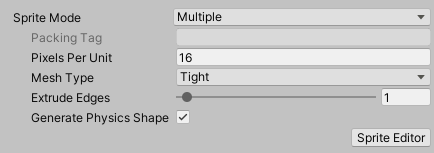
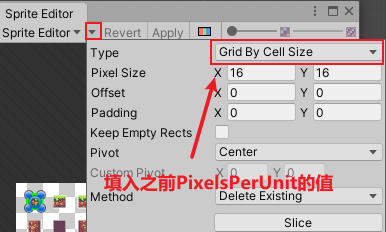
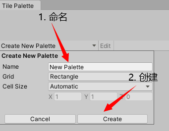

### Unity Tilemap

**Unity 2D瓦片地图编辑器**

#### 一、Tilemap安装 

该功能需在Unity2017.2以上版本使用。

Unity Window  => Package Manager => 2D TilemapEditor => Install

#### 二、瓦片素材处理

处理图集，切分图集，将图集中的元素切割成瓦片方便调用。

- SpriteMode：Multiple，多张Sprite。

- PixelsPerUnit：每个单元像素数量，尽量选择2的次方数的像素，如16，32，64...

- SpriteEditor：指定尺寸切割图集。

    

    

#### 三、TilePalette使用

创建TilePalette并进行编辑。

1. 新建TilePalette

    Window => 2D => Tile Palette

    

2. 载入瓦片素材

    将之前处理好的瓦片素材直接拖入TilePalette中即可完成载入

3. 创建Tilemap

    Hierarchy右键菜单 => 2D Object => Tilemap

4. 进行地图编辑

    利用TilePalette中的素材在Tilemap上进行编辑

5. 工具栏介绍（从上到下、从左到右介绍）

    

    - 选中：场景中选中单个或多个方格以进行后续操作，如移动等。可以在使用别的工具时按住Ctrl实现选中。
    - 移动：先选中需要移动的单位再进行平移。
    - 笔刷：使用TilePalette中选中的瓦片进行绘制。
    - 平铺：使用TilePalette中选中的瓦片进行矩形平铺。
    - 吸管：选中瓦片时，自动进行吸管操作，获取当前瓦片。
    - 橡皮：擦除Tilemap中的瓦片，按住Ctrl可定义橡皮大小。
    - 填充：向封闭空间内填充TilePalette中选中的瓦片。
    - ActiveTilemap：当前选中Tilemap。
    - Edit：TilePalette的瓦片可以像Tilemap一样实现重新布局。

6. 组件介绍

    - Grid：
        - CellSize：单元格大小
        - CellGap：单元格间隙
        - CellLayout：单元格布局
        - CellSwizzie：单元格重排
    - TilemapRenderer：OrderInLayer大的Tilemap在上，小的在下，可以实现多图层效果。
    - TilemapCollider2D：Tilemap实现碰撞
